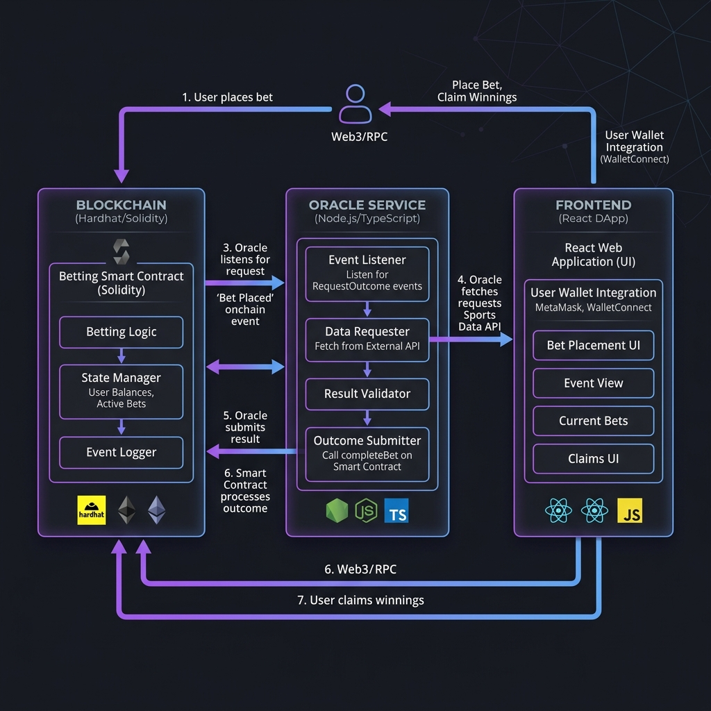
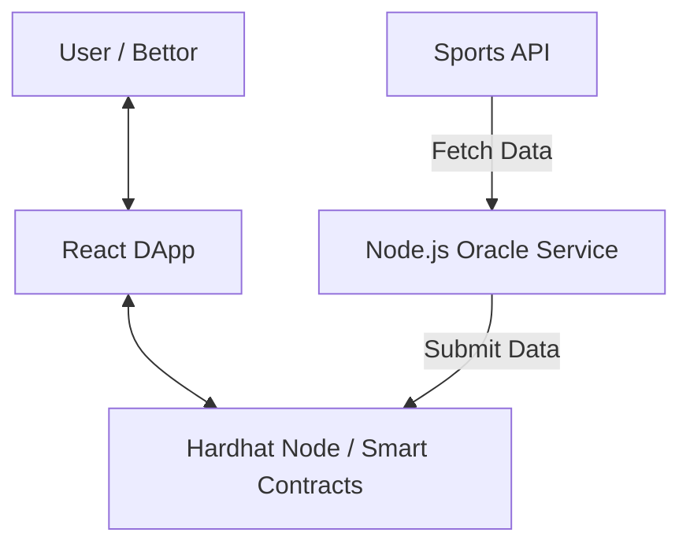

# Decentralized Sports Betting Oracle System

A full-stack decentralized application featuring a custom off-chain oracle system. This project demonstrates how to bridge real-world data onto the blockchain using Node.js and Solidity.

## 🏗️ Architecture

The system consists of three main components:
1. **Blockchain Layer**: Solidity smart contracts (`SportsOracle.sol` and `BettingMarket.sol`) running on a local Hardhat node.
2. **Oracle Service**: A Node.js/Express service that fetches sports data and submits it to the `SportsOracle` contract.
3. **Frontend DApp**: A React/Vite/TypeScript application for users to connect wallets and place bets.

### Data Flow Diagram





## 🚀 Getting Started

### Prerequisites
- Docker & Docker Compose
- Node.js (v18+)
- MetaMask browser extension

### Quick Start
1. Clone the repository.
2. Run the entire stack using Docker Compose:
   ```bash
   docker-compose up --build
   ```
3. The services will be available at:
   - **Frontend**: http://localhost:5173
   - **Oracle Service**: http://localhost:3001
   - **Hardhat RPC**: http://localhost:8545

### 🦊 MetaMask Setup (Local Testing)
To interact with the local Hardhat node:
1. Open MetaMask and add a **Custom RPC Network**:
   - **Network Name**: Hardhat Local
   - **New RPC URL**: http://localhost:8545
   - **Chain ID**: 31337
   - **Currency Symbol**: ETH
2. Import a test account using one of Hardhat's default private keys (e.g., `0xac0974bec39a17e36ba4a6b4d238ff944bacb478cbed5efcae784d7bf4f2ff80`).

## 🧪 Testing

The project includes a comprehensive testing suite across all layers:

### Smart Contracts
```bash
cd blockchain
npx hardhat test
npx hardhat coverage # 100% Coverage achieved
```

### Oracle Service
```bash
cd oracle-service
npm test # Unit & API tests
```

### Frontend
```bash
cd frontend
npm test # Vitest unit tests
```

## 🔌 API Reference (Oracle Service)

The Oracle service provides endpoints to simulate real-world data feeds.

### Submit Player Data
`POST /api/trigger-update`
```json
{
  "matchId": 1,
  "playerId": 101,
  "pointsScored": 28
}
```

### Finalize Match
`POST /api/trigger-finalize`
```json
{
  "matchId": 1,
  "playerId": 101
}
```

## 🛡️ Security & Best Practices
- **Access Control**: Only the designated oracle address can submit or finalize data on the `SportsOracle` contract.
- **Resilience**: The oracle service implements health checks and transaction receipt verification.
- **Containerization**: Programmatic health checks ensure the Hardhat node is ready before the Oracle service starts.
- **Rich UI**: High-end glassmorphic design with Tailwind CSS and Lucide icons.
