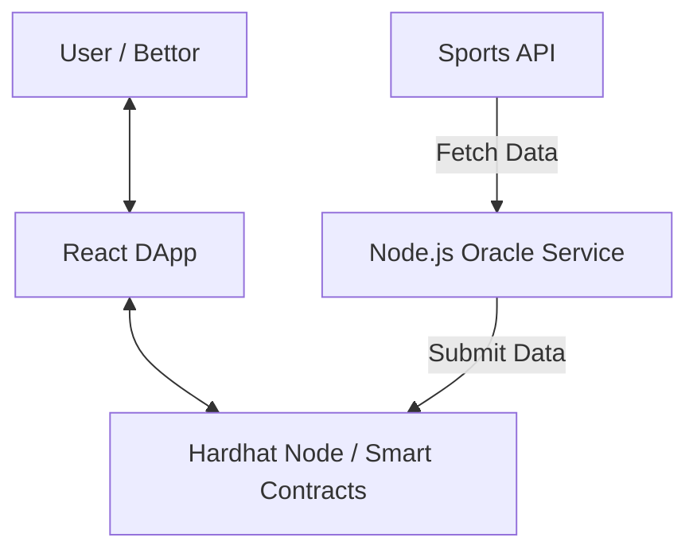

# a-Decentralized-Sports-Betting-Oracle-System-with-Node.js-and-Solidity

A full-stack decentralized application featuring a custom off-chain oracle system. This project demonstrates how to bridge real-world data onto the blockchain using Node.js and Solidity.

## 🏗️ Architecture

The system consists of three main components:
1. **Blockchain Layer**: Solidity smart contracts (`SportsOracle.sol` and `BettingMarket.sol`) running on a local Hardhat node.
2. **Oracle Service**: A Node.js/Express service that fetches sports data and submits it to the `SportsOracle` contract.
3. **Frontend DApp**: A React/Vite/TypeScript application for users to connect wallets and place bets.

### Data Flow Diagram




## 🚀 Getting Started

### Prerequisites
- Docker & Docker Compose
- Node.js (v18+)
- MetaMask browser extension

### Quick Start
1. Clone the repository.
2. Run the entire stack using Docker Compose:
   ```bash
   docker-compose up --build
   ```
3. The services will be available at:
   - **Frontend**: http://localhost:5173
   - **Oracle Service**: http://localhost:3001
   - **Hardhat RPC**: http://localhost:8545

### Manual Setup (Development)

#### 1. Blockchain
```bash
cd blockchain
npm install
npx hardhat node
# In another terminal
npx hardhat run scripts/deploy.ts --network localhost
```

#### 2. Oracle Service
```bash
cd oracle-service
npm install
# Update .env with deployed contract addresses
npm run dev
```

#### 3. Frontend
```bash
cd frontend
npm install
npm run dev
```

## 🧪 Testing

Run smart contract tests with coverage:
```bash
cd blockchain
npx hardhat coverage
```

## 🔌 API Reference (Oracle Service)

### Submit Player Data
`POST /api/trigger-update`
```json
{
  "matchId": 1,
  "playerId": 101,
  "pointsScored": 28
}
```

### Finalize Match
`POST /api/trigger-finalize`
```json
{
  "matchId": 1,
  "playerId": 101
}
```

## 🛡️ Security & Best Practices
- **Access Control**: Only the designated oracle address can submit or finalize data.
- **Resilience**: The oracle service uses asynchronous transaction handling and receipt verification.
- **Rich UI**: The frontend uses Tailwind CSS and Lucide icons for a premium experience.
